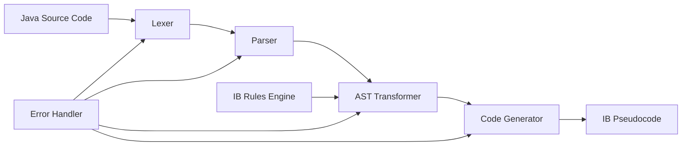

# Design Document

## Overview

The Java to IB Pseudocode Converter is a TypeScript npm library that transforms Java source code into IB Computer Science pseudocode format. The library uses a multi-stage pipeline approach: lexical analysis, parsing into an Abstract Syntax Tree (AST), transformation of the AST according to IB rules, and code generation to produce the final pseudocode output.

The design emphasizes modularity, extensibility, and robust error handling to support educational use cases where code quality and clear error messages are essential.

## Architecture

The library follows a pipeline architecture with four main stages:



### Core Components

1. **Lexer**: Tokenizes Java source code into meaningful tokens
2. **Parser**: Builds an Abstract Syntax Tree from tokens
3. **AST Transformer**: Applies IB pseudocode transformation rules
4. **Code Generator**: Produces formatted pseudocode output
5. **IB Rules Engine**: Encapsulates IB-specific conversion rules
6. **Error Handler**: Manages parsing and conversion errors

## Components and Interfaces

### Main API Interface

```typescript
interface JavaToIBConverter {
  convert(javaCode: string, options?: ConversionOptions): ConversionResult;
}

interface ConversionOptions {
  preserveComments?: boolean;
  strictMode?: boolean;
  indentSize?: number;
}

interface ConversionResult {
  pseudocode: string;
  success: boolean;
  errors: ConversionError[];
  warnings: ConversionWarning[];
  metadata: ConversionMetadata;
}
```

### AST Node Types

```typescript
interface ASTNode {
  type: NodeType;
  location: SourceLocation;
  children?: ASTNode[];
}

enum NodeType {
  PROGRAM = 'Program',
  CLASS_DECLARATION = 'ClassDeclaration',
  METHOD_DECLARATION = 'MethodDeclaration',
  VARIABLE_DECLARATION = 'VariableDeclaration',
  IF_STATEMENT = 'IfStatement',
  WHILE_LOOP = 'WhileLoop',
  FOR_LOOP = 'ForLoop',
  ASSIGNMENT = 'Assignment',
  BINARY_EXPRESSION = 'BinaryExpression',
  METHOD_CALL = 'MethodCall',
  ARRAY_ACCESS = 'ArrayAccess',
  LITERAL = 'Literal',
  IDENTIFIER = 'Identifier'
}
```

### Transformation Rules Interface

```typescript
interface TransformationRule {
  nodeType: NodeType;
  transform(node: ASTNode, context: TransformationContext): PseudocodeNode;
}

interface TransformationContext {
  variables: Map<string, VariableInfo>;
  methods: Map<string, MethodInfo>;
  currentScope: ScopeInfo;
  ibRules: IBRulesEngine;
}
```

### IB Rules Engine

```typescript
interface IBRulesEngine {
  convertVariableName(javaName: string): string;
  convertOperator(javaOperator: string): string;
  convertControlStructure(type: string, condition?: string): string;
  convertMethodDeclaration(method: MethodInfo): string;
  convertDataType(javaType: string): string | null;
}
```

## Data Models

### Token Model

```typescript
interface Token {
  type: TokenType;
  value: string;
  location: SourceLocation;
}

enum TokenType {
  KEYWORD = 'keyword',
  IDENTIFIER = 'identifier',
  LITERAL = 'literal',
  OPERATOR = 'operator',
  PUNCTUATION = 'punctuation',
  WHITESPACE = 'whitespace',
  COMMENT = 'comment'
}
```

### Variable and Method Information

```typescript
interface VariableInfo {
  originalName: string;
  pseudocodeName: string;
  type: string;
  scope: string;
}

interface MethodInfo {
  originalName: string;
  pseudocodeName: string;
  returnType: string;
  parameters: ParameterInfo[];
  isVoid: boolean;
}

interface ParameterInfo {
  originalName: string;
  pseudocodeName: string;
  type: string;
}
```

### Pseudocode Generation Model

```typescript
interface PseudocodeNode {
  type: PseudocodeNodeType;
  content: string;
  indentLevel: number;
  children?: PseudocodeNode[];
}

enum PseudocodeNodeType {
  STATEMENT = 'statement',
  BLOCK = 'block',
  EXPRESSION = 'expression',
  COMMENT = 'comment'
}
```

## Error Handling

### Error Classification

1. **Lexical Errors**: Invalid characters, unterminated strings
2. **Syntax Errors**: Malformed Java syntax, missing tokens
3. **Semantic Errors**: Undefined variables, type mismatches
4. **Conversion Warnings**: Unsupported constructs, approximations

### Error Reporting

```typescript
interface ConversionError {
  type: ErrorType;
  message: string;
  location: SourceLocation;
  severity: ErrorSeverity;
}

enum ErrorType {
  LEXICAL_ERROR = 'lexical',
  SYNTAX_ERROR = 'syntax',
  SEMANTIC_ERROR = 'semantic',
  CONVERSION_ERROR = 'conversion'
}

enum ErrorSeverity {
  ERROR = 'error',
  WARNING = 'warning',
  INFO = 'info'
}
```

## Testing Strategy

### Unit Testing

1. **Lexer Tests**: Token generation for various Java constructs
2. **Parser Tests**: AST generation for valid and invalid Java code
3. **Transformation Tests**: Rule application for each Java construct
4. **Code Generation Tests**: Pseudocode output formatting and correctness
5. **Integration Tests**: End-to-end conversion of complete Java programs

### Test Categories

1. **Basic Syntax Tests**: Variables, assignments, expressions
2. **Control Structure Tests**: If-else, loops, nested structures
3. **Method Tests**: Functions, procedures, parameters, return values
4. **Array Tests**: Declarations, access, operations
5. **I/O Tests**: Input/output statement conversions
6. **Error Handling Tests**: Invalid input, unsupported constructs
7. **Edge Case Tests**: Complex expressions, deeply nested code

### Test Data Sources

1. **IB Specification Examples**: Direct examples from the IB pseudocode rules
2. **Educational Java Code**: Common patterns used in CS education
3. **Synthetic Test Cases**: Generated cases for edge conditions
4. **Real-world Examples**: Java code from textbooks and curricula

## Implementation Approach

### Phase 1: Core Infrastructure
- Implement basic lexer and token types
- Create AST node definitions and parser foundation
- Set up error handling framework
- Establish testing infrastructure

### Phase 2: Basic Transformations
- Implement variable declaration and assignment conversion
- Add basic expression and operator transformation
- Create simple statement conversion (output, input)
- Implement basic control structure conversion (if-else)

### Phase 3: Advanced Features
- Add loop conversion (while, for)
- Implement method/function conversion
- Add array operation support
- Enhance error reporting and validation

### Phase 4: Polish and Optimization
- Improve code generation formatting
- Add comprehensive error messages
- Optimize performance for large code files
- Complete documentation and examples

## Dependencies

### Core Dependencies
- **TypeScript**: Language and type system
- **No external parsing library**: Custom lexer/parser for educational transparency

### Development Dependencies
- **Jest**: Testing framework
- **ESLint**: Code quality
- **Prettier**: Code formatting
- **TypeDoc**: Documentation generation

### Rationale for Custom Parser

Using a custom lexer/parser instead of existing Java parsing libraries provides:
1. **Educational Value**: Teachers can understand and modify the conversion logic
2. **Lightweight**: Minimal dependencies for easy integration
3. **Customization**: Tailored specifically for IB pseudocode requirements
4. **Error Control**: Custom error messages suited for educational contexts